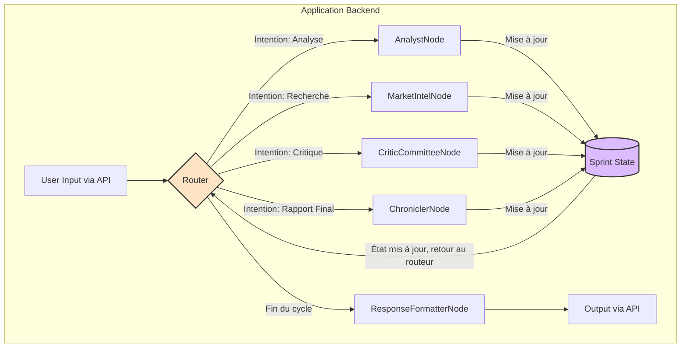

# Architecture du Système d'Agents : Cognitive Sprint Facilitator

## 1\. Vision du Produit

**Cognitive Sprint Facilitator** est une solution logicielle d'assistance par intelligence artificielle, conçue pour les facilitateurs et les équipes engagées dans des ateliers d'innovation structurés comme le "Foundation Sprint". Accessible via une interface de chat intégrée, il agit comme un partenaire numérique qui capture, analyse, évalue et enrichit les discussions de l'équipe en temps réel pour produire une "Founding Hypothesis" robuste et validée.

## 2\. Paradigme Architectural : LangGraph

Pour construire ce système, nous utilisons **LangGraph**, une extension de LangChain. Ce choix est délibéré car le workflow d'un atelier n'est pas linéaire.

  - **Stateful (À état) :** L'état du sprint (décisions, idées, analyses) doit être maintenu et accessible durant toute la session (plusieurs jours).
  - **Cyclique :** Le processus implique des boucles, notamment pour le cycle "Actor-Critic" où une proposition est générée, puis évaluée, puis potentiellement révisée.
  - **Multi-Agents :** Plusieurs agents spécialisés doivent collaborer, parfois en parallèle (comme le comité de "Critics"), et modifier un état partagé.

LangGraph est spécifiquement conçu pour modéliser ces systèmes complexes en représentant les agents comme des **nœuds** et la logique de décision comme des **arêtes** dans un graphe d'états.

## 3\. Composants Clés de l'Architecture

L'application s'articule autour de quatre composants fondamentaux gérés par LangGraph.

### a. L'Objet d'État (`SprintState`)

C'est le cœur du système, la **source de vérité unique** qui circule à travers le graphe. C'est un objet de données (par exemple, un dictionnaire Python ou un Pydantic model) qui contient toute la mémoire vivante du sprint.

```python
# Exemple de structure du State
class SprintState:
    session_id: str
    user_request: str
    history: list
    sprint_decisions: dict # {'customer': '...', 'problem': '...'}
    proposals_to_evaluate: list[dict]
    critiques: dict # {'proposal_id_1': [critique_1, critique_2]}
    final_report: str
```

### b. Les Nœuds (`Nodes`) : Nos Agents Spécialisés

Chaque agent que nous avons défini (`Scribe`, `Analyst`, `Critic`, etc.) est implémenté comme un **nœud** dans le graphe. Un nœud est une fonction qui :

1.  Reçoit l'état (`SprintState`) actuel.
2.  Exécute sa logique spécialisée (appelle un LLM avec son propre prompt, un outil, etc.).
3.  Retourne une mise à jour de l'état.

**Agents de Production (Actors) :**

  * `ScribeNode`: Transcrit les inputs utilisateur dans `state.history`.
  * `AnalystNode`: Analyse `state.history` et `state.sprint_decisions` pour produire des `state.proposals_to_evaluate`.
  * `MarketIntelNode`: Utilise un outil de recherche pour enrichir le `state`.
  * `VisualiserNode`: Produit des visualisations (diagrammes, graphiques) pour aider l'équipe à comprendre les données.
  * `ChroniclerNode`: Compile les `state.sprint_decisions` pour générer le `state.final_report`.

**Comité d'Évaluation (Critics) :**

  * `CriticCommitteeNode`: Un nœud qui peut appeler en parallèle plusieurs "sous-logiques" ou "sous-agents" Critics. Chaque Critic (Faisabilité, Désirabilité, Stratégie, etc.) prend une proposition en entrée et produit un objet `critique` qui est ajouté au `state.critiques`.

  * `FeasibilityCritic`: Évalue la faisabilité technique et opérationnelle des propositions.
  * `DesirabilityCritic`: Analyse l'attrait et la pertinence pour les utilisateurs finaux.
  * `StrategyCritic`: Vérifie l'alignement stratégique avec les objectifs de l'organisation.
  * `FinancialCritic`: Estime les impacts financiers et le ROI potentiel.
  * `MarketingCritic`: Examine la différenciation, le positionnement et les opportunités de marché.
  * `EthicsCritic`: Valide les implications éthiques et la conformité aux valeurs.
  * `LegalCritic`: Vérifie la conformité légale et la gestion des risques juridiques.
  * `OperationsCritic`: Anticipe les contraintes opérationnelles et la mise en œuvre.

### c. Le Routeur (`Router`) : Le Cerveau de l'Orchestrateur

Le `SprintMaestro_Agent` n'est pas un nœud, mais **la logique de routage du graphe**. Après chaque nœud, le routeur examine le `SprintState` pour décider quelle sera la prochaine étape.

  - **Exemple de Logique :**
      - **SI** `state.user_request` contient une demande d'analyse, **ALORS** aller au `AnalystNode`.
      - **SI** `state.proposals_to_evaluate` n'est pas vide, **ALORS** aller au `CriticCommitteeNode`.
      - **SI** le cycle de critique est terminé, **ALORS** aller au `ResponseFormatterNode` pour préparer la réponse à l'utilisateur.
      - **SINON**, attendre une nouvelle entrée utilisateur.

### d. Le Graphe (`Graph`)

C'est l'objet final compilé par LangGraph qui assemble l'état, les nœuds et le routeur pour créer l'application exécutable.

## 4\. Schéma du Flux d'Exécution

Le schéma ci-dessous illustre comment une requête utilisateur traverse le système.



## 5\. Mise en Œuvre Pratique

### a. Structure de Fichiers Recommandée

```
/cognitive-sprint-facilitator
|-- /app                    # PRD (en cours)
|   |-- main.py             # Point d'entrée de l'API (FastAPI, Flask)
|   |-- graph.py            # Définition et compilation du graphe LangGraph
|-- /agents
|   |-- scribe_node.py
|   |-- analyst_node.py
|   |-- critics/
|   |   |-- feasibility_critic.py
|   |   |-- desirability_critic.py
|   |   `-- ...
|-- /prompts
|   |-- scribe_prompt.txt
|   |-- analyst_prompt.txt
|   `-- ...
|-- /tools
|   |-- web_search.py
|-- README.md
```

### b. Exemple d'un Nœud (`AnalystNode`)

Voici à quoi ressemblerait la structure de code pour un nœud.

```python
# dans agents/analyst_node.py

from langchain_core.prompts import ChatPromptTemplate
from langchain_openai import ChatOpenAI
from state import SprintState # Votre définition de l'objet State

# Charger le prompt depuis un fichier pour la modularité
prompt = ChatPromptTemplate.from_template(open("prompts/analyst_prompt.txt").read())
llm = ChatOpenAI(model="gpt-4o", temperature=0.5)

analyst_chain = prompt | llm

def analyst_node(state: SprintState) -> SprintState:
    """Analyse les données du sprint pour générer des insights."""
    
    # 1. Extraire les données nécessaires du state
    sprint_data = state["sprint_decisions"]
    
    # 2. Invoquer la chaîne LLM avec le prompt et les données
    response = analyst_chain.invoke({"sprint_data": sprint_data})
    
    # 3. Mettre à jour le state avec le résultat
    state["proposals_to_evaluate"] = response.content # ou un format structuré
    
    return state
```